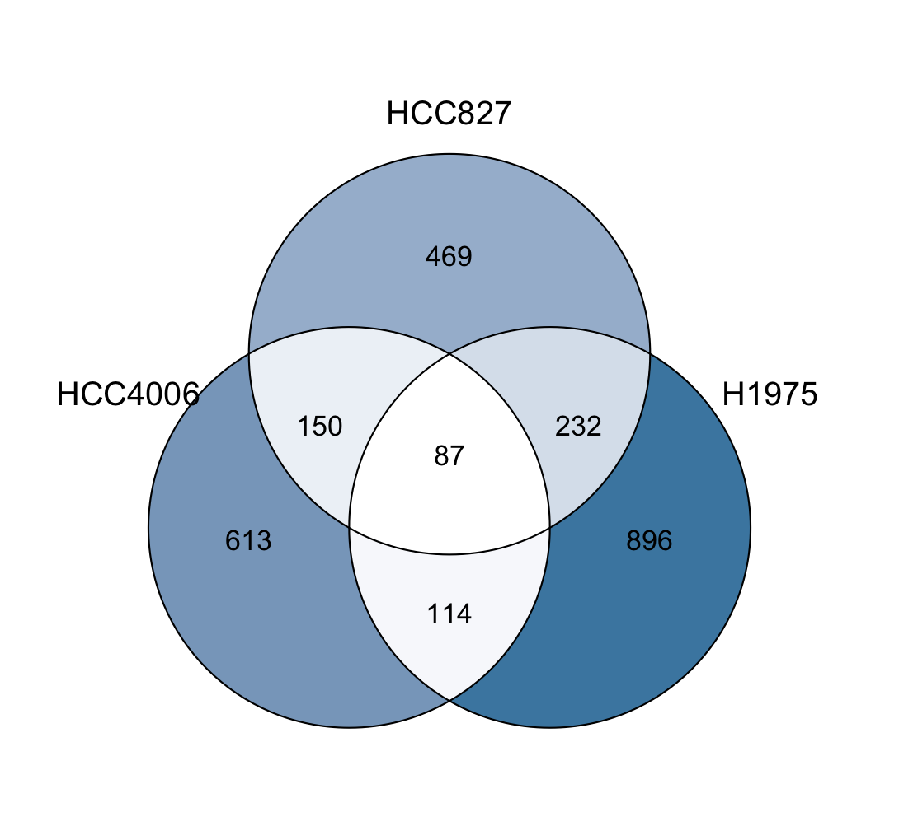
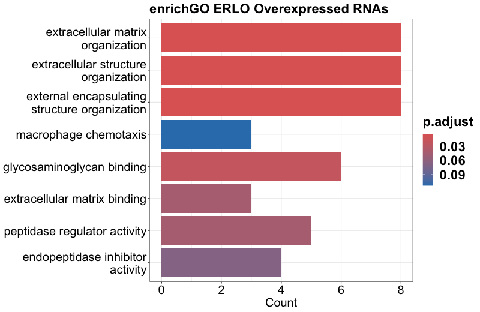

# RNA-seq Analysis of TKI Persistent Cells in Lung Cancer

Bioinformatics workflow for RNA-seq preprocessing, quantification, differential expression analysis, and functional enrichment in lung cancer cell models exposed to tyrosine kinase inhibitors (TKIs).

This repository documents an RNA-seq analysis developed to investigate transcriptional differences associated with persistent/residual cell populations following TKI exposure. It combines Bash workflows for sequencing-data preprocessing with RSEM quantification and edgeR differential-expression analysis.

## Project overview

The downstream dataset contains three lung cancer cell lines:

| Cell line | Conditions |
| --- | --- |
| HCC827 | CONTROL, DMSO, Erlotinib, Osimertinib |
| HCC4006 | CONTROL, DMSO, Erlotinib, Osimertinib |
| H1975 | CONTROL, Osimertinib |

The included downstream metadata contains 20 biological sample identifiers, with two samples represented for each experimental condition.

The principal differential-expression comparisons evaluate treated/persistent populations against the corresponding control population within each cell line.

## Workflow

```text
Paired-end FASTQ
       |
       v
 FastQC / MultiQC
       |
       v
Trimmomatic AVGQUAL
       |
       v
    cutadapt
       |
       v
Trimmomatic MINLEN
       |
       +----------------------+
       |                      |
       v                      v
Standalone STAR          RSEM + STAR
alignment / QC           quantification
                              |
                              v
                       expected counts
                              |
                              v
                           tximport
                              |
                              v
                            edgeR
                     TMM normalization
                     GLM quasi-likelihood
                              |
                  +-----------+-----------+
                  |                       |
                  v                       v
         Differential expression    GO enrichment
```

The standalone STAR workflow is retained for genome-alignment assessment and QC. RSEM performs STAR alignment against an RSEM-prepared reference for gene- and transcript-level quantification.

## Differential-expression analysis

The main downstream workflow is implemented in `bin/DGE_TKIS.R`.

RSEM `*.genes.results` files are imported with `tximport` and analyzed with edgeR. The historical analytical strategy is preserved:

- low-expression filtering: **log2-CPM > 1 in at least 3 samples**
- normalization: **TMM**
- model: **negative-binomial generalized linear model**
- inference: **edgeR quasi-likelihood F-test**
- differential-expression threshold: **|log2FC| >= 1**
- multiple-testing correction: **Benjamini-Hochberg**
- significance threshold: **FDR <= 0.05**

Sample groups are constructed from the biological metadata rather than inferred by truncating sample names.

Downstream analyses include Ensembl BioMart gene annotation, comparison of shared differentially expressed genes across cell models, and Gene Ontology enrichment with `clusterProfiler`.

## Repository structure

```text
.
├── bin/
│   ├── 1.Quality_control.sh
│   ├── 2.Cleaning.sh
│   ├── 3.Alignment.sh
│   ├── 4.RSEM.sh
│   ├── DGE_TKIS.R
│   └── functions.R
├── Data/
│   └── sample_Persistent.txt
├── Results/
│   ├── PCAplot.pdf
│   ├── Venn_Diagram_ERLO.png
│   ├── Venn_Diagram_OSI.png
│   ├── Barplot_ERLO.png
│   ├── Barplot_osi.png
│   └── differential-expression tables
├── config.example.sh
├── config.example.R
└── README.md
```

## Example outputs

Selected analytical outputs from the original analysis are retained in the repository.

### Shared genes following osimertinib exposure



### Gene Ontology enrichment



These figures are representative outputs. Biological conclusions should be interpreted in the context of the complete experimental design and appropriate experimental validation.

## Configuration

Machine-specific paths are excluded from version control.

For preprocessing:

```bash
cp config.example.sh config.sh
```

Edit `config.sh` with the FASTQ locations, GRCh38 FASTA/GTF reference files, computational resources, and output directories.

For downstream analysis:

```bash
cp config.example.R config.R
```

Set `RSEM_DIR` to the directory containing RSEM results organized by biological sample identifier.

Both `config.sh` and `config.R` are ignored by Git.

## Sample identifiers

Two naming systems were used during the historical workflow.

Early sequencing preprocessing used temporary technical identifiers such as:

```text
t01, t02, ..., t18
```

Downstream analysis used biologically meaningful identifiers such as:

```text
HCC827_OSI_1
HCC4006_ERLO_2
H1975_CONTROL_1
```

The exact technical-to-biological sample mapping is not included in this repository and is therefore not reconstructed or inferred.

The historical preprocessing scripts contain 18 technical sequencing identifiers, whereas the downstream biological metadata contains 20 samples. These may correspond to different stages or batches of the historical workflow; without the original mapping information, no one-to-one correspondence is claimed.

## Data availability and reproducibility

This repository is a **documented computational workflow and analysis portfolio**, rather than a fully self-contained reproducibility package.

Raw FASTQ files, reference genome files, STAR indices, and complete RSEM outputs are not distributed here because of their size and/or original storage context.

The repository provides:

- FASTQ quality-control and preprocessing scripts
- STAR alignment workflow
- RSEM quantification workflow
- configurable path templates
- downstream sample metadata
- edgeR differential-expression analysis
- functional enrichment workflow
- selected analysis outputs

Reproducing the complete workflow from raw sequencing data requires the corresponding FASTQ files, the appropriate GRCh38 reference and annotation, and verified sample-identity information.

## Technologies

- **RNA-seq:** FastQC, MultiQC, Trimmomatic, cutadapt, STAR, RSEM
- **Bioinformatics:** R, Bash, tximport, edgeR, TMM normalization, GLM quasi-likelihood analysis
- **Functional analysis:** Ensembl BioMart, clusterProfiler, Gene Ontology
- **Visualization:** PCAtools, ggplot2, EnhancedVolcano, RVenn, enrichplot

## Author

**Mario Pérez-Medina**

Molecular Biology & Bioinformatics · Mexico City, Mexico

- GitHub: [maperezm](https://github.com/maperezm)
- Email: maperezm.medi@gmail.com

---

This repository reflects a research RNA-seq workflow cleaned and documented for scientific and bioinformatics portfolio use. Historical analytical decisions are preserved where possible, while machine-specific paths and incomplete exploratory analyses are kept outside the core workflow.
